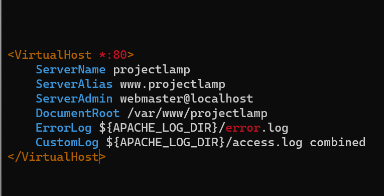
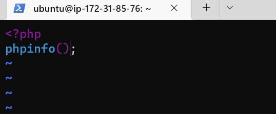

# **LAMP STACK IMPLEMENTATION (LAMP STACK) IN AWS**

*Login to EC2 Server*

`sudo apt update`

`sudo apt install apache2`

`sudo systemctl status apache2`

---

## Html Image for apache2 default page

## **My SQL Installation**

`sudo apt install mysql-server`

`sudo mysql`

`sudo mysql_secure_installation`

## PHP Installation

`sudo apt install php libapache2-mod-php php-mysql`

php -v

## Creating Virtual Host using Apache

`sudo mkdir /var/www/projectlamp`

`sudo chown -R $USER:$USER /var/www/projectlamp`

`sudo vi /etc/apache2/sites-available/projectlamp.conf`

`sudo ls /etc/apache2/sites-available`

`sudo a2ensite projectlamp`

`sudo a2dissite 000-default`

`sudo apache2ctl configtest`

`sudo systemctl reload apache2`

`sudo echo 'Hello LAMP from hostname' $(curl -s http://169.254.169.254/latest/meta-data/public-hostname) 'with public IP' $(curl -s http://169.254.169.254/latest/meta-data/public-ipv4) > /var/www/projectlamp/index.html`

**Checking the status code on web browser**

## Enabling PHP on Website

`sudo vim /etc/apache2/mods-enabled/dir.conf`

`{
<IfModule mod_dir.c>
        DirectoryIndex index.php index.html index.cgi index.pl index.xhtml index.htm
</IfModule>
}`

`sudo systemctl reload apache2`

`vim /var/www/projectlamp/index.php`

*checking code status on browser*

