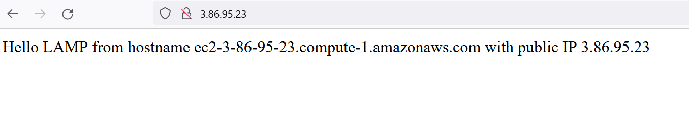

# PROJECT - 1 - LAMP STACK IMPLEMENTATION (LAMP STACK) IN AWS

## What is a Technology stack?

A technology stack is a set of frameworks and tools used to develop a software product. This set of frameworks and tools are very specifically chosen to work together in creating a well-functioning software. They are acronymns for individual technologies used together for a specific technology product. 
example:
**LAMP (Linux, Apache, MySQL, PHP or Python, or Perl)**

**Login to EC2 Server**


`sudo apt update`

`sudo apt install apache2`

`sudo systemctl status apache2`

---


## Html Image for apache2 default page


## **My SQL Installation**

`sudo apt install mysql-server`

`sudo mysql`


`sudo mysql_secure_installation`


## **PHP Installation**

`sudo apt install php libapache2-mod-php php-mysql`

php -v


## **Creating Virtual Host using Apache**

`sudo mkdir /var/www/projectlamp`

`sudo chown -R $USER:$USER /var/www/projectlamp`

`sudo vi /etc/apache2/sites-available/projectlamp.conf`

``` <VirtualHost *:80>
    ServerName projectlamp
    ServerAlias www.projectlamp 
    ServerAdmin webmaster@localhost
    DocumentRoot /var/www/projectlamp
    ErrorLog ${APACHE_LOG_DIR}/error.log
    CustomLog ${APACHE_LOG_DIR}/access.log combined
</VirtualHost>
```

`sudo ls /etc/apache2/sites-available`

`sudo a2ensite projectlamp`

`sudo a2dissite 000-default`

`sudo apache2ctl configtest`

`sudo systemctl reload apache2`

```
sudo echo 'Hello LAMP from hostname' $(curl -s http://169.254.169.254/latest/meta-data/public-hostname) 'with public IP' $(curl -s http://169.254.169.254/latest/meta-data/public-ipv4) > /var/www/projectlamp/index.html
```


**Checking the status code on web browser**


## **Enabling PHP on Website**

`sudo vim /etc/apache2/mods-enabled/dir.conf`

```
<IfModule mod_dir.c>
        #Change this:
        #DirectoryIndex index.html index.cgi index.pl index.php index.xhtml index.htm
        #To this:
        DirectoryIndex index.php index.html index.cgi index.pl index.xhtml index.htm
</IfModule>
```

`sudo systemctl reload apache2`

Create a new file named index.php inside your custom web root folder:

`vim /var/www/projectlamp/index.php`

```
<?php
phpinfo();
```
*checking code status on browser*


completed
