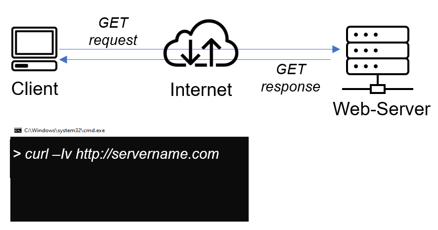
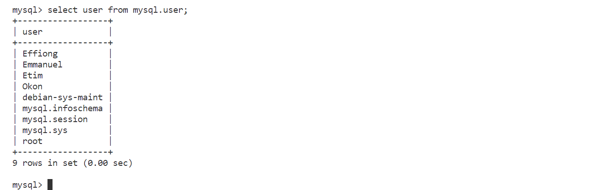

# Implement a Client Server Architecture using MySQL Database Management System (DBMS)

To demonstrate a basic client-server using MySQL Relational Database Management System (RDBMS).

*Create and configure two Linux-based virtual servers (EC2 instances in AWS).*

`sudo apt update`

`sudo apt install mysql-server`

`sudo systemctl enable mysql`

`sudo systemctl status mysql`

`sudo mysql`

`ALTER USER 'root'@'localhost' IDENTIFIED WITH mysql_native_password BY 'password';`

`exit`

`sudo mysql_secure_installation`

## Create a User and database on the MYSQL Server

`sudo mysql`

`CREATE USER 'Emmanuel'@'%' IDENTIFIED WITH mysql_native_password BY 'password';`

`CREATE USER 'Effiong'@'%' IDENTIFIED WITH mysql_native_password BY 'password';`

`CREATE USER 'Etim'@'%' IDENTIFIED WITH mysql_native_password BY 'password';`

`CREATE USER 'Okon'@'%' IDENTIFIED WITH mysql_native_password BY 'password';`

`CREATE DATABASE drillteam;`

`GRANT ALL ON drillteam. * TO 'Emmanuel'@'%' WITH GRANT OPTION;`

`FLUSH PRIVILEGES;`

`exit`

## Installation of MYSQL Client on the Client
*Connect to the Client Server*

`sudo apt update`

`sudo apt install mysql-client`

## Configuring the MYsql-Server for remote connection on the DB-Server

`sudo vi /etc/mysql/mysql.con.d/mysqld.cnf`

Change the bind-address in the file from 127.0.0.1 to 0.0.0.0 to allow connection from all ip address

restart mysql server to all the new config to start running

`sudo systemctl restart mysql`

## Connection to the Mysql Server from the Mysql client using Mysql utility on Client

`sudo mysql -u niyi -h 172.31.33.209 -p`

Insert Password

`show databases`

completed

